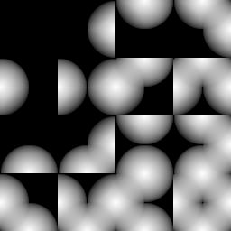

# Wang Tiles

This Project is heavily (almost too much) inspired by [Tsoding Daily's Project On Wang Tiles](https://www.youtube.com/playlist?list=PLpM-Dvs8t0VYgJXZyQzWjfYUm3MxcvqR0).
It might be considered a port of the project to Golang.

## Introduction
[Wang tiles](http://www.cr31.co.uk/stagecast/wang/intro.html) is a mathematical concept for procedural generation that was proposed by Hao Wang in 1961. Each tile has 4 sides. Each side can have one of 2 colors. Thus, each tile can be represented as a 4 bit number.

These tiles are stacked together with some specific rules.
- all 4 edges of a tile must **match** with it's neighbour
- All cells of the grid are filled, there is no overloap or empty cell.

This leads to very interesting patterns and visualisations.

## Usage
```console
go run main.go {output-filename}
```
`output-filename` = must be a `jpeg`, default="./temp/atlas.jpeg"

## Goals
- To learn about procedural generation using wang-tiles. 
- To learn about GoLang's idiomatic way of doing things and exploring multiple solutions to the same problem.
- To learn more about go-routines and generate graphics using nothing but the CPU.

## Phases
This project is done in phases (again, very similar to Tsoding Daily's project) and each phase might add or remove stuff from the codebase. Please go through every phase to understand the journey.

### Phase 1 - Atlas Rendering
A single struct named [`Tile`](./wang/tile.go) is responsible for representing a single tile in the project. It `embeds` the `image.Image` type from golang. It's colors are dicided with a single `uint8` called `bltr`.
The method [`wangFragmentShader`](./wang/tile.go) is analogus to fragment shaders in graphics libraries. It takes in normalized co-ordintaes and outputs a color for that particular coordinte.
BLTR stands for Bottom, Left, Top, Right. It represents the order in which the bits represent the colors of a tile.

Doing This in a loop for each possible `bltr` results in an atlas of all posible wang tiles (kind of like a sprite sheet.).



#### Things I learnt
- I learnt about `image.Image` type and how to use it to manipulate images in golang. (It can be thought of as a wrapper around a 2D array which makes it easy to deal with images).
- I learnt about `vardiac functions` which let you take a variable number of arguments e.g. the definition of `fmt.Printf` is 
    ```golang 
    func Printf(format string, a ...interface{}) (n int, err error)
    ```
- I also learn about go-routines and how they can help in parrellely processing individual tiles in of the wang-tiles set.
- I implemented a [basic linear algebra library](./linalg/) to help in calculations
